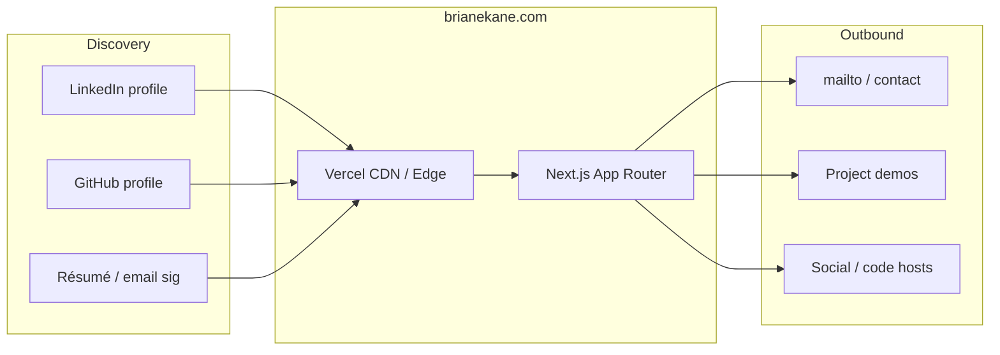

# BrianEKane.com — Professional landing site

Marketing and recruiting homepage for **Brian E. Kane**, implemented as a statically optimized **Next.js** application. The site is intended to be linked from **LinkedIn**, GitHub, résumés, and email signatures so visitors—recruiters, hiring managers, and fellow engineers—can quickly assess technical depth, focus areas, and how work is structured in code.

Product intent and detailed UX requirements live in [`REQUIREMENTS.md`](REQUIREMENTS.md). This README emphasizes **technology choices**, **architecture**, and **how to run or extend the project**.

---

## Technology stack

| Layer | Choices | Notes |
|--------|---------|--------|
| **Framework** | [Next.js](https://nextjs.org/) **16** (App Router) | Server-first defaults; React Server Components where applicable |
| **UI runtime** | [React](https://react.dev/) **19** | Concurrent features aligned with current Next.js |
| **Language** | [TypeScript](https://www.typescriptlang.org/) **5** | Strict typing across app, components, and tests |
| **Styling** | [Tailwind CSS](https://tailwindcss.com/) **4** | Utility-first layout and design tokens via CSS variables |
| **Fonts** | `next/font/google` (Geist, Geist Mono) | Self-hosted subset loading, no layout shift from webfont swaps |
| **Testing** | [Vitest](https://vitest.dev/) **4**, [Testing Library](https://testing-library.com/), [jsdom](https://github.com/jsdom/jsdom) | Unit/component tests with **≥90% line coverage** threshold on included paths (see `frontend/vitest.config.ts`) |
| **Linting** | [ESLint](https://eslint.org/) **9**, `eslint-config-next` | Aligns with Next.js 16 defaults |
| **Package manager** | [Yarn](https://yarnpkg.com/) (Classic) | Lockfile under `frontend/`; repo root delegates scripts with `yarn --cwd frontend` |
| **Runtime** | Node.js **≥ 20.9** | Matches `engines` in `frontend/package.json` |
| **Hosting** | [Vercel](https://vercel.com/) | Next.js preset; build/install commands configured per root vs `frontend/` (see [Deployment](#deployment) and [`docs/DEPLOYMENT.md`](docs/DEPLOYMENT.md)) |

There is **no separate backend service** in this repository: the site is a content-forward frontend with optional **public** configuration injected at build time.

---

## Architecture (for reviewers)

### System context

How the property fits into a typical visitor journey:



### Application structure

The homepage composes **presentational sections** driven by **typed content modules** and **environment-backed links**. That separation keeps copy and URLs editable without restructuring layout code.

```mermaid
flowchart TB
  subgraph config["Configuration"]
    ENV["Repo-root `.env` / `frontend/.env.local`"]
    NEXT["`next.config.ts` — loads env, exposes `PUBLIC_*` to client"]
  end

  subgraph domain["Domain data"]
    CONTENT["`lib/content.ts`, `lib/projects.ts`, …"]
    LINKS["`lib/site-links.ts`"]
    RESUME["`lib/resume-files.ts` → `public/resume/`"]
  end

  subgraph ui["Presentation"]
    LAYOUT["`app/layout.tsx` — metadata, theme boot, shell"]
    PAGE["`app/page.tsx` — section composition"]
    COMP["`components/*` — Hero, About, FeaturedProjects, …"]
  end

  ENV --> NEXT
  NEXT --> LINKS
  CONTENT --> COMP
  LINKS --> COMP
  RESUME --> COMP
  LAYOUT --> PAGE
  COMP --> PAGE
```

### Public environment variables

Client-visible URLs and contact targets use a deliberate **`PUBLIC_*`** prefix (not `NEXT_PUBLIC_*`). [`frontend/next.config.ts`](frontend/next.config.ts) reads the **repository root** `.env` first, then `frontend/` env files, and forwards an allow-listed set into the browser bundle. Names and placeholders are documented in [`.env.example`](.env.example).

### Themes and accessibility

- **Themes:** Three palettes; preference persisted in **`localStorage`** under `brianekane-theme` (see [`frontend/lib/themes.ts`](frontend/lib/themes.ts)). A small **before-interactive** script applies the saved theme to avoid flash of wrong theme.
- **Accessibility:** Skip link to `#main-content`, semantic landmarks, and focus-visible patterns in the shell (`layout.tsx`).

---

## Repository layout

| Path | Role |
|------|------|
| [`frontend/`](frontend/) | Next.js application root (dependencies, `yarn.lock`, source) |
| [`frontend/app/`](frontend/app/) | App Router entry: `layout.tsx`, `page.tsx`, global styles |
| [`frontend/components/`](frontend/components/) | Section and shell UI |
| [`frontend/lib/`](frontend/lib/) | Copy, projects, themes, résumé paths, site links |
| [`frontend/public/`](frontend/public/) | Static assets (images, résumé downloads) |
| [`package.json`](package.json) | Thin root scripts delegating to `frontend/` |
| [`vercel.json`](vercel.json) | Install/build when Vercel root is **`.`** |
| [`frontend/vercel.json`](frontend/vercel.json) | Install/build when Vercel **Root Directory** is **`frontend`** |
| [`docs/DEPLOYMENT.md`](docs/DEPLOYMENT.md) | Step-by-step Vercel import, DNS, env vars, and troubleshooting |

---

## Local development

**Prerequisites:** Node.js **≥ 20.9** and **Yarn**.

```bash
yarn --cwd frontend install
yarn dev
```

Open `http://localhost:3000`.

Other useful commands:

| Command | Purpose |
|---------|---------|
| `yarn build` | Production build (`yarn --cwd frontend build`) |
| `yarn start` | Serve production output locally |
| `yarn lint` | ESLint across the frontend |
| `yarn --cwd frontend test` | Vitest run |
| `yarn --cwd frontend test:coverage` | Coverage report (thresholds in `vitest.config.ts`) |

---

## Deployment

**Intended host:** Vercel (Next.js framework preset).

**Root directory:** Prefer setting Vercel **Root Directory** to **`frontend`** so `yarn.lock` is discovered naturally and [`frontend/vercel.json`](frontend/vercel.json) applies. If the project root is **`.`**, use root [`vercel.json`](vercel.json) so install/build run inside `frontend/` (otherwise a root-only `npm` flow can miss `next` on the path).

**Domains:** Configure `brianekane.com` / `www` in Vercel and apply the DNS records they provide (e.g. Route 53). Do not guess A/CNAME targets—they can change.

**Environment variables:** Mirror [`.env.example`](.env.example) in **Vercel → Project → Settings → Environment Variables**. Redeploy after changes. For email, use a full `mailto:` URL for `PUBLIC_CONTACT_EMAIL` when set.

For the full walkthrough (root directory vs `.`, dashboard overrides, “preview without project”, DNS, and troubleshooting), see **[`docs/DEPLOYMENT.md`](docs/DEPLOYMENT.md)**.

---

## Editing content

| Concern | Primary files |
|---------|----------------|
| Narrative / SEO meta | [`frontend/lib/content.ts`](frontend/lib/content.ts), metadata in [`frontend/app/layout.tsx`](frontend/app/layout.tsx) |
| Featured projects | [`frontend/lib/projects.ts`](frontend/lib/projects.ts) |
| External links | [`frontend/lib/site-links.ts`](frontend/lib/site-links.ts) + env vars |
| Résumé downloads | [`frontend/lib/resume-files.ts`](frontend/lib/resume-files.ts), files under [`frontend/public/resume/`](frontend/public/resume/) |
| Imagery | [`frontend/public/images/`](frontend/public/images/) |

---

## Engineering philosophy (what this repo demonstrates)

- **Separation of concerns:** UI components vs centralized content and link configuration.
- **Typed, testable modules:** Vitest + Testing Library on sections and critical libs; coverage gates on selected paths.
- **Operational clarity:** Explicit Node engine, frozen lockfile-friendly Vercel commands, and documented env contract for recruiters-friendly links (LinkedIn, GitHub, demos).
- **Performance-minded defaults:** App Router, font optimization, static-friendly homepage composition.

For stakeholders who care about *what the page must communicate*, continue with [`REQUIREMENTS.md`](REQUIREMENTS.md).
