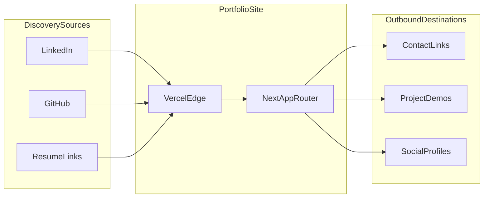
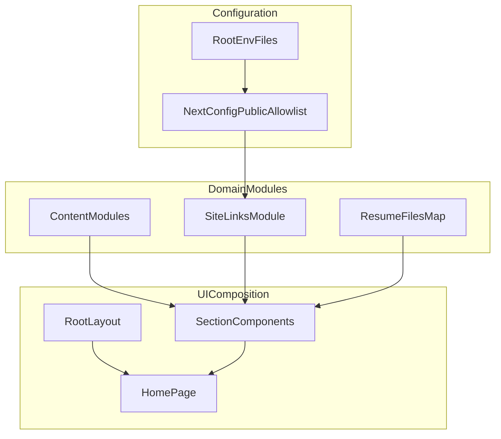

# BrianEKane.com

Professional portfolio and recruiting site for Brian E. Kane.

- Live site: [https://www.brianekane.com](https://www.brianekane.com)
- Focus: senior software engineering, full-stack delivery, and applied AI engineering
- Stack: Next.js 16 App Router, React 19, TypeScript, Tailwind CSS v4, Vitest

`REQUIREMENTS.md` is the product brief. This README is the source of truth for implementation, architecture, setup, and quality gates.

## Quick Links

- Product requirements: [`REQUIREMENTS.md`](REQUIREMENTS.md)
- Deployment runbook: [`docs/DEPLOYMENT.md`](docs/DEPLOYMENT.md)
- App root: [`frontend`](frontend)
- Homepage composition entry: [`frontend/app/page.tsx`](frontend/app/page.tsx)
- Metadata and shell layout: [`frontend/app/layout.tsx`](frontend/app/layout.tsx)

## Five Minute Reviewer Tour

1. Start with [`frontend/app/page.tsx`](frontend/app/page.tsx) to see section composition and page flow.
2. Review [`frontend/lib/content.ts`](frontend/lib/content.ts), [`frontend/lib/projects.ts`](frontend/lib/projects.ts), and [`frontend/lib/site-links.ts`](frontend/lib/site-links.ts) for typed content and environment-backed links.
3. Inspect [`frontend/components/FeaturedProjects.tsx`](frontend/components/FeaturedProjects.tsx) and [`frontend/components/ThemeProvider.tsx`](frontend/components/ThemeProvider.tsx) for interaction and state boundaries.
4. Check [`frontend/next.config.ts`](frontend/next.config.ts) for env loading and `PUBLIC_*` allow-list forwarding.
5. Read representative tests:
   - [`frontend/components/FeaturedProjects.test.tsx`](frontend/components/FeaturedProjects.test.tsx)
   - [`frontend/components/FeaturedProjects.real-data.test.tsx`](frontend/components/FeaturedProjects.real-data.test.tsx)
   - [`frontend/next.config.test.ts`](frontend/next.config.test.ts)

## Technology Stack

| Layer | Choice | Notes |
|---|---|---|
| Framework | [Next.js](https://nextjs.org/) 16 (App Router) | Server-first rendering with client islands only where needed |
| UI runtime | [React](https://react.dev/) 19 | Modern React APIs aligned with Next.js 16 |
| Language | [TypeScript](https://www.typescriptlang.org/) 5 | Strict typing across app and tests |
| Styling | [Tailwind CSS](https://tailwindcss.com/) 4 | Utility-first styling with theme tokens in CSS variables |
| Testing | [Vitest](https://vitest.dev/), Testing Library, jsdom | Fast unit/component testing with behavior-focused assertions |
| Linting | ESLint 9 + `eslint-config-next` | Next.js-aligned lint rules |
| CI | GitHub Actions | Lint, test, and coverage checks on push/PR |
| Hosting | [Vercel](https://vercel.com/) | Deployment flow documented in `docs/DEPLOYMENT.md` |

No separate backend service lives in this repository. This project is a statically optimized frontend site with public config values injected at build time.

## Architecture

### System Context



### Application Composition



## Key Technical Decisions

- `PUBLIC_*` env contract with explicit allow-list in [`frontend/next.config.ts`](frontend/next.config.ts) instead of broad client env exposure.
- Typed content modules in [`frontend/lib`](frontend/lib) instead of CMS dependency to keep a small portfolio surface maintainable.
- `frontend` as explicit app root, with root script delegation for consistent local and CI commands.
- Vitest + Testing Library for fast iteration and deterministic UI behavior checks, with coverage thresholds for included production paths.

## Repository Layout

| Path | Purpose |
|---|---|
| [`frontend/`](frontend/) | Next.js app, lockfile, and source |
| [`frontend/app/`](frontend/app/) | App Router entrypoints and global styles |
| [`frontend/components/`](frontend/components/) | UI components and sections |
| [`frontend/lib/`](frontend/lib/) | Typed content, links, project data, theme metadata |
| [`frontend/public/`](frontend/public/) | Images and downloadable resume assets |
| [`docs/DEPLOYMENT.md`](docs/DEPLOYMENT.md) | Vercel and DNS deployment procedures |
| [`.github/workflows/quality.yml`](.github/workflows/quality.yml) | CI quality checks |

## Local Development

Prerequisites:

- Node.js >= 20.19.0
- Yarn

Setup:

```bash
cp .env.example .env
yarn --cwd frontend install
yarn dev
```

Open `http://localhost:3000`.

Common commands from repository root:

| Command | Purpose |
|---|---|
| `yarn dev` | Start local development server |
| `yarn build` | Build production artifacts |
| `yarn start` | Run production server |
| `yarn lint` | Run ESLint |
| `yarn test` | Run Vitest suite |
| `yarn test:coverage` | Run Vitest with coverage report |

## Configuration

Environment variables are declared in [`.env.example`](.env.example) and loaded in this order:

1. repo root `.env`
2. `frontend/.env.local` (overrides root values)

Browser-visible keys are allow-listed `PUBLIC_*` values only. For contact email, set `PUBLIC_CONTACT_EMAIL` as a full `mailto:` URL when overriding.

## Testing And Quality Gates

- Test runner: Vitest
- UI testing: Testing Library + jsdom
- Coverage policy: line threshold is set to 90% for included paths in [`frontend/vitest.config.ts`](frontend/vitest.config.ts)
- CI workflow: [`.github/workflows/quality.yml`](.github/workflows/quality.yml) runs lint, tests, and coverage on push and pull requests

Current coverage gate is intentionally scoped to selected production files listed in `vitest.config.ts`, not every file in the repository.

## Accessibility And Mobile Responsiveness

This project includes explicit accessibility and mobile checks as part of hiring-readiness:

- Semantic landmarks and skip navigation are implemented in [`frontend/app/layout.tsx`](frontend/app/layout.tsx) and verified by [`frontend/app/layout.accessibility.test.tsx`](frontend/app/layout.accessibility.test.tsx).
- Mobile navigation behavior and ARIA state transitions are verified in [`frontend/components/Header.test.tsx`](frontend/components/Header.test.tsx).
- Theme controls use grouped semantics and pressed-state indicators in [`frontend/components/ThemeSelector.tsx`](frontend/components/ThemeSelector.tsx).
- Interactive controls use touch-friendly target sizing (`min-h-10` or `min-h-11`) across primary CTAs and navigation.
- External links use `noopener noreferrer` on `target="_blank"` profile links (validated in [`frontend/components/ContactFooterLinks.test.tsx`](frontend/components/ContactFooterLinks.test.tsx)).
- Reduced motion preference is respected via `prefers-reduced-motion` handling in [`frontend/app/globals.css`](frontend/app/globals.css).

Quick local validation flow:

```bash
yarn lint
yarn test
yarn build
```

## Deployment

Target platform: Vercel with Next.js preset.

- Preferred Vercel root directory: `frontend`
- If Vercel root is `.`, use root [`vercel.json`](vercel.json)
- If Vercel root is `frontend`, use [`frontend/vercel.json`](frontend/vercel.json)

Full deployment, DNS, and troubleshooting details are in [`docs/DEPLOYMENT.md`](docs/DEPLOYMENT.md).

## Featured Projects Catalog

Homepage cards read from [`frontend/lib/projects.ts`](frontend/lib/projects.ts) at build time. Update that file when adding or changing tiles; use this section as the human-editable catalog and copy reference.

Override demo and repo URLs via `PUBLIC_*` keys in [`.env.example`](.env.example) (see [`frontend/lib/site-links.ts`](frontend/lib/site-links.ts)).

| Title | Status | Demo | Repo |
|---|---|---|---|
| AI Digital Twin | coming-soon | — | — |
| Agentic Coding Team | private-code | — | — |
| React Enterprise Application | live | — | GitHub profile |
| The Hallucination Tribunal (RAG Document Assistant) | live | [Vercel demo](https://hallucination-tribunal.vercel.app/) | [Hallucination_Tribunal](https://github.com/bkane56/Hallucination_Tribunal) |
| National Park Trip Planner | live | Hugging Face Space | `national_park_crew` |
| MediNotes Pro | live | [Vercel demo](https://saas-bice-iota.vercel.app/) | [consultationAI](https://github.com/bkane56/consultationAI) |

### MediNotes Pro

Healthcare AI documentation assistant: clinician consultation input becomes structured visit summaries, doctor next steps, and patient-friendly email drafts.

- **Privacy architecture:** Ollama runs in a Docker container (local: `ollama serve`; production: Render private Ollama service). Browser talks to FastAPI; backend calls private Ollama. No third-party LLM API on the primary deployed inference path, reducing PHI/PII exposure to external model vendors.
- **Demo boundary:** Synthetic patient data only. Not a production clinical system and not a HIPAA compliance claim.
- **Env keys:** `PUBLIC_CONSULTATION_AI_DEMO_URL`, `PUBLIC_CONSULTATION_AI_GITHUB_URL`

## Roadmap

- Ship AI Digital Twin experience
- Add project case studies for private and pending builds
- Expand AI workflow portfolio with architecture write-ups

## Documentation Map

- [`README.md`](README.md): implementation and engineering guide
- [`REQUIREMENTS.md`](REQUIREMENTS.md): product and UX intent
- [`docs/DEPLOYMENT.md`](docs/DEPLOYMENT.md): operations and deployment
- [`AGENTS.md`](AGENTS.md): agent automation instructions

## Engineering Notes

This repository is optimized for reviewer clarity:

- clear module boundaries between content, links, and UI composition
- explicit env contracts and deployment behavior
- automated quality checks through CI
- practical tests around user-visible behavior and config contracts
